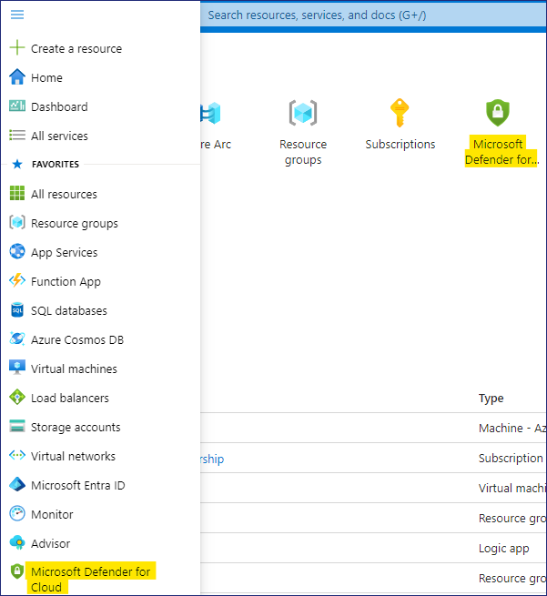
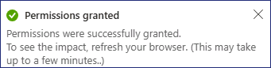
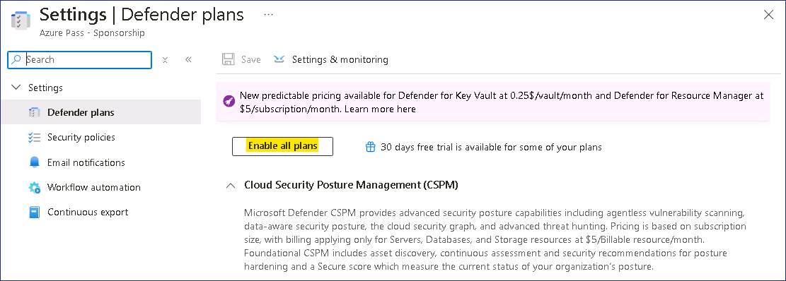
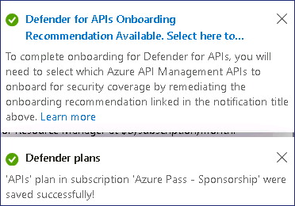

# Lab 1 - Microsoft Sentinel Deployment

**Objectives**

This Lab guides you through the deployment of the Microsoft Sentinel solutions that will be used in all subsequent Labs.


**Exercise 1 - Setting up the environment and Deploying Microsoft
Sentinel All In One**

**Time - 50 minutes**

**Task 1 - Redeeming the Azure pass**

1.  Login to the **Lab VM** using the credentials provided on the Resources/Home tab of the Lab interface.

2.  In your Lab VM, open Microsoft Edge browser and open the following link: ```http://www.microsoftazurepass.com```

3.  On **Ready to get started?** page, click on the **Start** button.

    <kbd></ked>


4. Enter the **Office 365 Tenant credentials** provided on the **Resources/Home** tab of the Lab interface to complete the sign in process

    <kbd></ked>


    > <font color=Orangered> **Note**:  Do not use your **Company/Work Account** to login to redeem the Azure Pass, another Azure Pass will not be issued.</font>


5.  On **The following Microsoft Account will be used for Azure
    pass** page, click on **Confirm Microsoft Account** button.

    <kbd></ked>

6. Enter the Promocode provided in the lab environment in the **Enter
    Promo code** field, then enter the characters under the **Enter the
    characters you see** field and click on the **Submit** button.

    <kbd></ked>

7. **We are processing your request** page will appear, it may take few
    seconds to process the redemption.

    <kbd></ked>

8. Enter the correct details in **Your Profile** page, tick all the
    check boxes, and then click on **Sign up** button.

    <kbd></ked>

    <kbd></ked>

    <kbd></ked>


9.  Click on the **Next** button on the **More information
    required** prompt.

    <kbd></ked>

10.  Provide the credentials and then complete the MFA sign in
    <kbd></ked>

11.  Once the authentication is completed, click on the **Done** button you will be redirected to the
    Azure Pass redemption page.
    <kbd></ked>

12. On **Are you satisfied with your signup experience** window, enter
    your feedback and click on the **Submit** button.

    <kbd></ked>

14. It would automatically redirect you to the Azure Portal and now you
    are ready to use Azure services. On **Welcome to Microsoft
    Azure** dialog box, click on the **Maybe later** button.

    <kbd></ked>

**Task 2 - Configure Permissions on the Subscription**

1.  In the **Azure Portal** ```https://portal.azure.com``` search box
    type ```subscriptions``` and then click **on Subscriptions**.

    <kbd></ked>

2.  From the list of Subscriptions select the **Azure Pass --
    Sponsorship**.

    <kbd></ked>

3.  On the **Azure Pass -- Sponsorship** page click on **Access control
    (IAM)</ked>**, then click on **+ Add** drop-down and select **Add role
    assignment**.

    <kbd></ked>

4.  On the Add role assignment page, under the **Privileged
    administrator roles** tab select **Contributor** and then click
    on **Next**.

    <kbd></ked>

5.  On the **Members** tab, click on **+ Select members**, then
    choose **your Office 365 Tenant credentials** and then click on
    the **Select** button.

    <kbd></ked>

6.  Click on **Review + assign** button.

    <kbd></ked>

7.  Click on **Review + assign** button again.

    <kbd></ked>

8.  You should get the notification as shown in below image.

    <kbd></ked>

9.  Click on the Role assignments tab to view the role assigned in the
    previous step. We can see the Users listed to whom
    the Contributor role was assigned.

    <kbd></ked>

**Task 3 - Registering required Resource providers**

1.  While still on the Subscription page, from the left menu, click on
    the **Resource Providers** under Settings.

    <kbd></ked>

2.  In the search bar, type ```Microsoft.insight```,
    select **Microsoft.insight** from the list below and click on
    Register.

    <kbd></ked>

3.  A notification stating Successfully registered resource provider is
    obtained once the registration is successful.

    <kbd></ked>

4.  Repeat the steps to register the following Resource providers.

    - ```Microsoft.web```

    - ```Microsoft.SecurityInsights```

    - ```Microsoft.Logic```

    <kbd></ked>

**Task 4 - Security Admin role to be added to Tenant Administrator
account**

1.  In the browser tab navigate
    to ```https://portal.azure.com/#view/Microsoft_AAD_UsersAndTenants/UserManagementMenuBlade/~/AllUsers``` 

    <kbd></ked>

2.  Select the **Assigned roles** under Manage and then click on **+ Add
    assignments.**

    <kbd></ked>

3.  Search and select **Security Administrator**, then click on
    the **Add** button.

    <kbd></ked>

    <kbd></ked>

**Task 5 - Enabling the trial for Microsoft Defender for cloud**

1.  While in the Azure Portal, click on the Portal menu or from the home
    page choose the Microsoft Defender for Cloud

    <kbd></ked>

2.  On the Notification – **You may be viewing limited information. To gettenant-wide visibility, click here -->** click on it.

    <kbd></ked>

3.  On the **Get permissions** page, choose the **Security Admin** and
    then click on **Get access** button.

    <kbd></ked>

4.  You should get the notification as shown in below images

    <kbd></ked>

    <kbd></ked>


5.  Refresh the browser and then in **Microsoft Defender for Cloud** page, under the **General** section,
    navigate and click on **Getting started**. In the **Upgrade** tab,
    navigate and click on the **Upgrade** button.

    > <font color=Orangered> **Note**: You may need to wait for a few minutes for the upgrade to complete.</font>

    <kbd></ked>


6.  On **Microsoft Defender for Cloud** page, navigate to **Management** section and click on **Environment settings.**

    > <kbd></ked>

7.  Scroll down and then expand **Tenant Root Group** and then click on the **Azure Pass – Sponsorship** Subscription listed.

    <kbd></ked>

8.  Notice the Defender coverage is **11/12 plans** for the Subscription.

9.  On **Settings | Defender plans** page, click on **Enable all plans.**

    <kbd></ked>

10.  Select **Microsoft Defender for APIs Plan 1** and then click on **Save** button. 
    <kbd></ked>

11.  Click on the **Save** button.
    <kbd></ked>

12.  You should get the notifications as shown in below image.

<kbd></ked>

**Task 6 - Deploy the Microsoft Sentinel.**

In this task we will see how to create a brand-new Microsoft Sentinel
workspace.

1. Navigate to the ```http://portal.azure.com``` and log in with the **MOD Administrator** credentials provided on the home tab of your lab
environment.

2.  In the top search bar, type ```Microsoft Sentinel``` and click on
**Microsoft Sentinel**.

    <kbd></ked>

3. In the **Microsoft Sentinel** screen, click **Create** at the top left.

    <kbd></ked>

4. You can choose to add **Microsoft Sentinel** to an existing **Log Analytics** **workspace** or build a new one. We will create a new one,
so click on **Create a new workspace**.

    <kbd></ked>

5.  In the Create Log Analytics workspace page, fill out the form as
follows:

    - Subscription: **Azure Pass - Sponsorship**

    - Resource Group: click on **Create new**  ```RG4Sentinel```

    - Region: **East US**

    - Workspace Name: ```swrkXXXXXXX``` \[Substitute **XXXXXXX** with random number]

    - Click **Review + create**.

        <kbd></ked>

6. Click **Create** after the validation completes. The creation takes a
    few seconds.

    <kbd></ked>

6. You will be redirected back to the **Add Microsoft Sentinel** to a
workspace page, click on the **Refresh** button.

    <kbd></ked>

7. Select your workspace and click **Add** at the bottom.

    <kbd></ked>

8. You should receive notification as shown in below image

    <kbd></ked>

9. Your Microsoft Sentinel workspace is now ready to use!, Click on the **OK** button.

    <kbd></ked>

**Task 7: Deploy the Microsoft Sentinel Training Lab Solution**

In this exercise you will deploy the Training Lab solution into your existing workspace. This will ingest pre-recorded data (~20 MBs)</ked> and create several other artifacts that will be used during the exercises.

1. In the Azure Portal ```http://portal.azure.com```, go to the top search
bar and type ```Microsoft Sentinel Training```. Select the **Microsoft
Sentinel Training Lab Solution (Preview)</ked>**, a Marketplace item.

    <kbd></ked>

2. Read the solution description and click **Create** at the top.

    <kbd></ked>

3. In the **Basics** tab, select **Azure pass - Sponsorship** as the
**Subscription**, **RG4Sentinel** as the **Resource Group** and
```SwrkXXXXXXX```  as the **Workspace**.

    <kbd></ked>

4. Optionally, review the different tabs (**Workbooks**, **Analytics**,
**Hunting Queries**, **Watchlists**, **Playbooks**)</ked> in the solution.
When ready, click on **Review + create**.

5. Once validation is ok, click on **Create**. The deployment process takes
about 15 minutes.

    <kbd></ked>

    > **Note** – The deployment will take up to 15 minutes to complete.

6. You can proceed ahead with the next exercise while the deployment is in
progress.

    <kbd></ked>

    <kbd></ked>

**Task 8 -- Explore the Microsoft Sentinel dashboard**

1.  In the top search bar, type Microsoft Sentinel and click on
    Microsoft Sentinel.

    <kbd></ked>

2.  On the Microsoft Sentinel screen, select the Log analytic workspace
    created during the deployment.

    <kbd></ked>

3.  The **Overview (Preview)</ked>** page provides the Dashboard display
    details for the below.

    i. **Incidents**

    ii. **Automation**

    iii. **Data**

    iv. **Analytics.**

    <kbd></ked>

4.  Incidents details will populate once the incidents occur in the
    environment.

    <kbd></ked>

5.  The Automation rules that are create will appear under the
    Automation dashboard.

    <kbd></ked>

6.  The Data dashboard will display the Connector health and Data
    received

    <kbd></ked>

7.  The Analytics dashboard will display the details of Analytics rules.

    <kbd></ked>

**Task 10 – Configure Microsoft Sentinel Playbook**

In this task, we will create a Playbook that will be later used in the
lab.

1.  Open a new tab and browse to the Resource group page
    - ```https://portal.azure.com/#view/HubsExtension/BrowseResourceGroups```

2.  Click on the Resource group **RG4Sentinel**.

    <kbd></ked>

3.  Click on **Access control (IAM)</ked>**, then click on **+ Add** drop-down
    and select **Add role assignment**.

    <kbd></ked>

4.  On the Add role assignment page, under the **Privileged
    administrator roles** tab select **Owner** and then click
    on **Next**.

    <kbd></ked>

5.  On the **Members** tab, click on **+ Select members**, then
    choose **your Office 365 Tenant credentials** and then click on
    the **Select** button.

    <kbd></ked>

6.  Click on the **Next** button.

7.  On the Conditions tab, click on the **Allow user to assign all roles
    (highly privileged)</ked>** radio button and click on **Review + assign**.

    <kbd></ked>

8.  On the **Review + assign** tab, click on the **Review +
    assign** button.

    <kbd></ked>

    <kbd></ked>

9.  From the **Microsoft Sentinel** navigation menu, go to **settings**.
    Select the **Settings** tab at the top of the page.

    <kbd></ked>

10. Scroll down and under **Playbook permissions**, select **Configure
    permissions**.

    <kbd></ked>

11. Select **RG4Sentinel** and select **Apply**.

    <kbd></ked>

12. You will see a message that you **Finished adding permissions**.

    <kbd></ked>

13. From the **Microsoft Sentinel** navigation menu,
    select **Automation**.

    <kbd></ked>

14. From the top menu, select **Create** \> **Playbook with incident
    trigger**.

    <kbd></ked>

15. Add the following details and click on **Next : Connections**.

    - Subscription -- **Azure Pass - Sponsorship**

    - Resource group -- **RG4Sentinel**

    - Playbook name -- ```customplaybook```

    - Check the box near Enable diagnostics logs in log analytics.

    <kbd></ked>

16. Click on **Next: Review and create**.

    <kbd></ked>

17. Then click on **Create playbook** button.

    <kbd></ked>

18. Click on + under the Microsoft Sentinel Incident 

    <kbd></ked>

19.	Click on Add an action
 
    <kbd></ked>

20.	Search for ```Add comment to incident``` and select Add comment to incident (V3)</ked> (Preview)</ked>.
    <kbd></ked>

21.	In the Incident ARM ID, type ```@triggerBody()</ked>?['object']?['id']```

22.	In the comment section type - ```This comment marks the successful run of our custom playbook.```

23.	If you do not see the step Connected to azuresentinel-customplaybook select Change Connection.
    <kbd></ked>

24.	Select azuresentinel-customplaybook.
    <kbd></ked>

25.	Click Save.
    <kbd></ked>

**Congratulations!!!!** You successfully created a playbook that adds the comment to any incidents. You can modify the steps according to your need in the flow designer to create custom automation flow.

**Task 9 - Configure Microsoft Sentinel Playbook**

In this task, we will configure a Playbook that will be later used in
the lab. This will allow the playbook to access Sentinel.

1.  From the Azure Portal ```http://portal.azure.com``` click on the
    Portal menu and select **Resource Groups**.

    <kbd></ked>

2.  Select **RG4Sentinel**.

    <kbd></ked>

3.  In the resource group you should see an API Connection resource
    called **azuresentinel-Get-GeoFromIpAndTagIncident**, click on it.

    <kbd></ked>

4.  Click on **Edit API connection** under **General**.

    <kbd></ked>

5.  Click on **Authorize** and a new window will open to choose an
    account.

    <kbd></ked>

6.  Select the **your Office 365 Tenant credentials** that you are logged in
    with. If prompted to sign in, sign in with the credentials given on
    the **Resources tab** of your lab.

    <kbd></ked>

7.  Click **Save** once the authorization is successful.

    <kbd></ked>

8.  You should receive notification as shown in below image

    <kbd></ked>

Congratulations, you have completed Lab 1!


